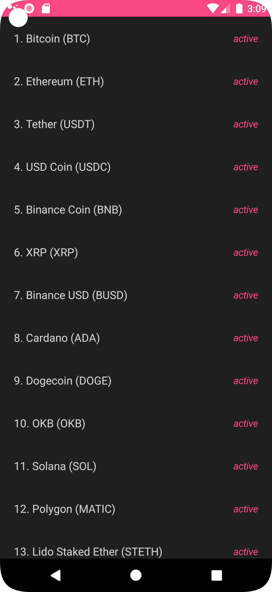

# CoinDex Cryptocurrency App

Coindex is a small cryptocurrency app that displays a list of cryptocurrencies.
Users can click on each coin to see more details about it.

This project used the following technologies:

- [Jetpack Compose](https://developer.android.com/jetpack/compose)
- [Retrofit](https://square.github.io/retrofit/)
- [Hilt](https://dagger.dev/hilt/)
- [Coroutines](https://kotlinlang.org/docs/reference/coroutines-overview.html)
- [CoinPaprika API](https://api.coinpaprika.com/)

The architecture used is CLEAN Architecture and divided into 4 layers: 
- data
- di (dependency injection)
- domain
- presentation

with a separate utils package.

## Screenshots

